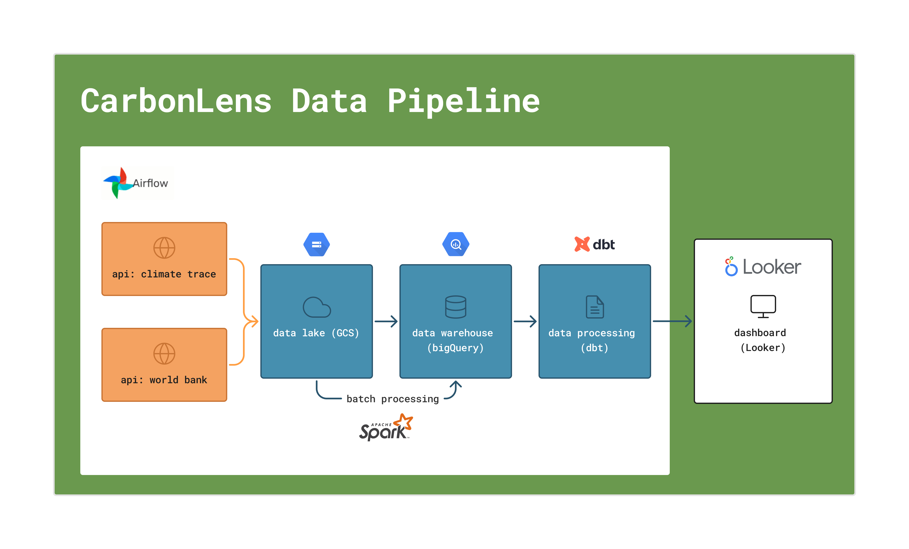
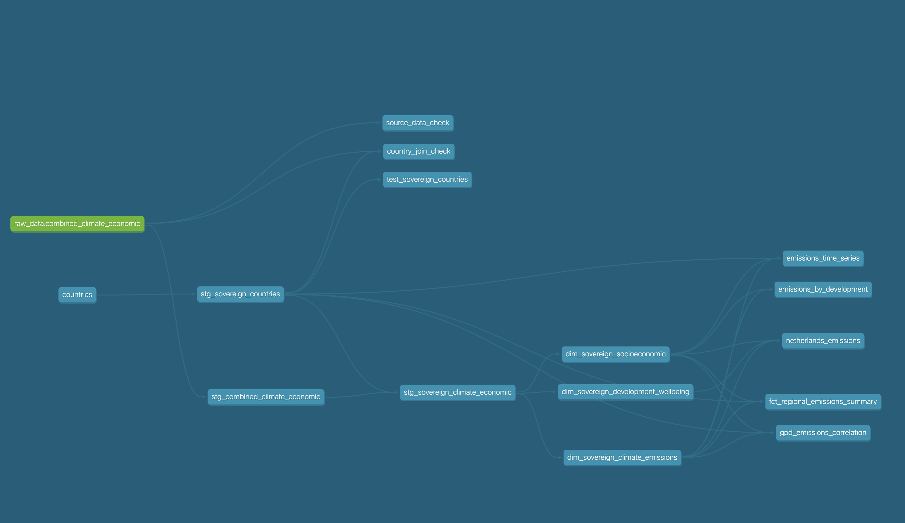

# CarbonLens - A Climate and Social Indicators Data Pipeline

**CarbonLens provides a clear lens to explore the intersection of emissions and development. 🌎 🌱📊**

This project implements an end-to-end data pipeline that:

- Extracts emissions data from [Climate Trace API](https://climatetrace.org/)
- Extracts social/economic indicators from [World Bank API](https://data.worldbank.org/)
- Loads the datasets into a datalake -> data warehouse
- Transforms the data to be fed to a dashboard
- Visualizes the data in an interactive dashboard

➡️ **[Evaluation criteria](#eval-zoomcamp) for Zoomcamp classmates**




**INDEX**

1. **[Project background](#-project-background)**
    [The problem](#️-the-problem)
    [The goal](#-the-goal)
    [The dashboard](#-the-dashboard)
2. **[Pipeline flow structure](#pipeline-flow-structure)**
    [Technologies applied](#technologies-applied)
    [Flow diagram](#flow-diagram)
    [Flow explanation](#flow-explanation)
    [Project components](#project-components)
3. **[How to replicate this project](#how-to-replicate-this-project)**
4. **[Project Limitations and Future Improvements](#project-limitations-and-future-improvements)**
5. **[Evaluation criteria - Zoomcamp](#evaluation-criteria-for-zoomcamp-classmates)**


----

<div id="project-backgroud"></div>

## 🌎 Project Background
This data engineering project leverages two key global datasets: [Climate Trace emissions](https://climatetrace.org/) data and [World Bank socioeconomic indicators](https://data.worldbank.org/indicator/). By combining these complementary datasets, we can explore relationships between countries' carbon footprints and their social/economic development metrics.

### ‼️ The Problem
Climate change analysis often lacks integration between emissions data and socioeconomic factors. Researchers and policymakers struggle to connect environmental impact with human development indicators, making it difficult to identify:

- Countries achieving economic growth with lower emissions
- Correlations between emissions and development metrics
- Equitable approaches to emissions reduction based on development status

### ✅ The Goal
Build an end-to-end data pipeline that:

- Extracts emissions data from Climate Trace API for all countries
- Extracts socioeconomic indicators from World Bank API (population, GDP, etc.)
- Integrates these datasets into a unified data warehouse
- Creates a dashboard with visualizations showing key relationships between emissions and development indicators

With the dashboard we should be able to answer questions like:

- How do emissions vary by economic development level?
- Which countries have the highest emissions?
- Is there a correlation between GDP and emissions?
- How has the emissions profile changed over time?

**This will enable data-driven insights into the complex interplay between development and environmental impact across different countries and regions.**

### 📊 The Dashboard

The dashboard can be found [on this link](https://lookerstudio.google.com/u/0/reporting/e02b247a-e5d1-47d0-a8c3-8b1a254029a2/page/BGa9E).
If at the time of reading this the board is not longer available (GCS is not cheap, after all 🤷🏽‍♀️), you can have an impression [by checking here](./dashboard/).


-------

<div id="pipeline-flow"></div>

##  Pipeline Flow Structure

This section explains the climate data pipeline architecture, which follows a modern data engineering approach by combining batch data extraction, cloud storage, processing with Spark/Python, transformation with dbt, and visualization in a dashboard. The pipeline integrates climate emissions data from Climate Trace with socioeconomic indicators from the World Bank to analyze relationships between economic development and greenhouse gas emissions.

### Technologies applied

- Airflow: Orchestrates the entire workflow (scheduling, monitoring, and managing tasks).
- GCS (Datalake): Stores the raw Climate Trace data.
- Spark: Processes and transforms large-scale data inside BigQuery.
- dbt: Performs further transformations and modeling for analytics (e.g., cleaning, aggregating).
- BigQuery: Acts as your data warehouse to store both raw and transformed data.
- Looker Studio: Visualizes the processed data to answer project questions.

### Flow diagram
```
                 +-----------------------------+
                 |  Climate Trace + World Bank |
                 +-----------------------------+
                               │
                               ▼
           +----------------------------------+
           |    Airflow (Data Extraction)     |
           +----------------------------------+
                               │
                               ▼
               +-------------------------+
               |    GCS (Data Lake)      |
               +-------------------------+
                               │
                               ▼
        +------------------------------------------+
        |    Airflow + Spark (Batch Processing)    |
        |        (Transforming Raw Data)           |
        +------------------------------------------+
                               │
                               ▼
          +---------------------------------+
          |    BigQuery (Data Warehouse)    |
          +---------------------------------+
                               │
                               ▼
        +----------------------------------------+
        |   Airflow + dbt (Data Transformation)  |
        +----------------------------------------+
                               │
                               ▼
      +------------------------------------------+
      |      BigQuery (Analytics Layer)          |
      +------------------------------------------+
                               │
                               ▼
          +-------------------------------+
          |   Looker Studio (Dashboard)   |
          +-------------------------------+
```

### Flow Explanation:
- [Climate Trace emissions](https://climatetrace.org/) and [World Bank socioeconomic indicators](https://data.worldbank.org/indicator/): Source datasets.

- Airflow (Extraction): Orchestrates the data extraction from both sources. 

- GCS (Datalake): Stores raw and intermediate datasets.

- Airflow + Spark (Batch Processing): Performs large-scale data transformations.

- BigQuery (Warehouse): Stores processed data from initial processing.

- Airflow + dbt (Transformation): Models and further transforms data in BigQuery.

- BigQuery (Analytics Layer): Optimized tables for reporting.

- Looker Studio: Visualizes the data through interactive dashboards.


### Project Components

**1. Data Lake Extraction Scripts**

**Climate Trace Emissions Extractor**
Extracts global emissions data by country:
- `climate_trace_extractor.py` - Fetches emissions data from Climate Trace API
  - Retrieves country-level greenhouse gas emissions data (CO2, CH4, N2O)
  - Calculates 20-year and 100-year global warming potentials
  - Handles API pagination and rate limiting
  - Outputs standardized CSV files to the data lake

**World Bank Data Extractor**
Extracts socioeconomic indicators by country:
- `world_bank_extractor.py` - Fetches population, GDP, and other development indicators
  - Retrieves multiple indicators using World Bank API
  - Fetches data for key development metrics (GDP, population, poverty, education)
  - Handles missing data and country code standardization
  - Outputs standardized CSV files with consistent country codes

**2. Airflow DAGs**

**Data Extraction DAG**
- `climate-data-dag.py` - Orchestrates the initial data extraction process
  - Runs extraction scripts for multiple years as configured
  - Uploads extracted data to Google Cloud Storage
  - Handles parallel extraction for different data sources
  - Supports both incremental and full refresh modes

**Data Processing DAGs**
- `spark-processing-dag.py` - Processes large datasets using Spark
  - Transforms raw CSV data into optimized Parquet format
  - Performs initial data cleaning and standardization
  - Creates external tables in BigQuery pointing to processed data

- `historical-spark-processing-dag.py` - Processes historical data on-demand
  - Handles data for specific years as requested
  - Includes branch logic to process only available datasets
  - Creates external tables for historical data analysis

- `historical-python-processing-dag.py` - Alternative processing with Python
  - Lighter-weight processing for smaller datasets
  - Creates BigQuery warehouse tables for transformed data

**DBT Transformation DAG**
- `dbt-transform-dag.py` - Runs dbt models to transform warehouse data
  - Manages dependencies with upstream processing tasks
  - Executes dbt run, test, and documentation commands
  - Supports parameterized runs for specific time periods

**3. dbt Models**

For clarity, the explanation for the dbt models used in this project [can be found here](./_intructions/dbt_explanation.md).

The dbt project consists of the following model layers:
- **Staging models**: Initial data preparation and type casting
- **Dimension models**: Business entity models with classifications
- **Fact models**: Aggregated metrics and measurements
- **Dashboard models**: Analysis-ready views for visualization

The lineage graph shows the relationships between these models:



**4. Cloud Infrastructure**

**Google Cloud Storage**
- Data lake for raw and processed files
- Organized with the following structure:
  - `/world_bank/` - World Bank indicators data
  - `/climate_trace/` - Climate Trace emissions data
  - `/processed/` - Processed Parquet files
  - `/combined/` - Joined datasets

**Google BigQuery**
- Data warehouse with the following datasets:
  - `zoomcamp_climate_raw` - External tables pointing to processed files
  - `zoomcamp_climate_warehouse` - Materialized tables for analysis

**Compute Engine / Kubernetes**
- Hosting environment for Airflow and Spark processing
- Configured for scaling based on workload requirements

**5. Dashboard**

**Google Data Studio / Looker**
- Interactive dashboard with the following visualizations:
  - Emissions by country income category
  - Regional emissions comparison
  - Emissions vs. GDP correlation analysis
  - Time series analysis of emissions trends
  - (TO DO NEXT) Netherlands-specific emissions profile

---

## How to replicate this project
If you'd like to replicate this project, you can find [all the instructions here](./_intructions/_instructions.md).

---

## Project Limitations and Future Improvements

This project was completed within a timeframe of approximately 40 hours.
While this allowed for the development of a functional data pipeline, it limited the depth and refinement possible in the final implementation.
**The primary focus was on exploration and delivery of core functionality.**

For a production-grade implementation, the following enhancements would be recommended:


- **Domain Knowledge Refinement**

    - Deepen climate science expertise to better interpret greenhouse gas impacts
    - Improve analysis methodology for comparing 20-year vs 100-year global warming potentials
    - Incorporate industry-specific emissions benchmarks and targets

- **Performance Optimization**

    - Implement incremental materialization in dbt models to reduce processing time and costs
    - Add parameterization for test/development runs to limit data processing
    - Optimize query performance through proper partitioning and clustering (already applied in this version, but it can be improved)
    - Benchmark and tune resource allocation across the pipeline

- **Infrastructure Improvements**

    - Complete cloud deployment with Infrastructure as Code (IaC)
    - Establish development, testing, and production environments
    - Implement comprehensive monitoring and alerting
    - Create local development setup that mirrors cloud configuration

- **Pipeline Orchestration**

    - Enhance DAG dependencies and error handling
    - Implement proper retry mechanisms
    - Add data quality validation between pipeline steps
    - Create maintenance windows and backfill procedures

- **Documentation and Governance**

    - Develop comprehensive data dictionary
    - Create lineage documentation
    - Implement data quality SLAs
    - Establish clear ownership and stewardship for datasets

These improvements would transform this exploratory project into a robust, production-ready data platform suitable for ongoing climate data analysis and reporting.

---

<div id="eval-zoomcamp"></div>

## Evaluation criteria (for Zoomcamp classmates)
- **Problem description**
    - **4 points:** Problem is well described and it's clear what the problem the project solves
    - ➡️ *You can check:* [Project background](#project-backgroud)


- **Cloud**
  - **2 points: The project is developed in the cloud**
  - ➡️  *You can check:* [instructions](./_intructions/_instructions.md)


- Data ingestion (**Batch / Workflow orchestration**)
  - **4 points:** End-to-end pipeline: multiple steps in the DAG, uploading data to data lake
  - ➡️ *You can check:* [Pipeline flow structure](#pipeline-flow)


- **Data warehouse**
  - **4 points:** Tables are partitioned and clustered in a way that makes sense for the upstream queries (with explanation)
  - ➡️*You can check:* [dbt explanation](./_intructions/dbt_explanation#clustering--partitioning.md)


- **Transformations (dbt, spark, etc)**
  - **4 points:** Tranformations are defined with dbt, Spark or similar technologies
  - ➡️ *You can check:* [dbt explanation](./_intructions/dbt_explanation)


- **Dashboard**
  - **4 points**: A dashboard with 2 tiles
  - ➡️ *You can check:* [dashboard](./dashboard/)


- **Reproducibility**
  - **4 points**: Instructions are clear, it's easy to run the code, and the code works
  - ➡️  *You can check:* [instructions](./_intructions/_instructions.md)


- Going the extra mile (Optional)
  - Add tests
   ➡️ *You can check:* [a few tests on dbt](./_intructions/tests.md)