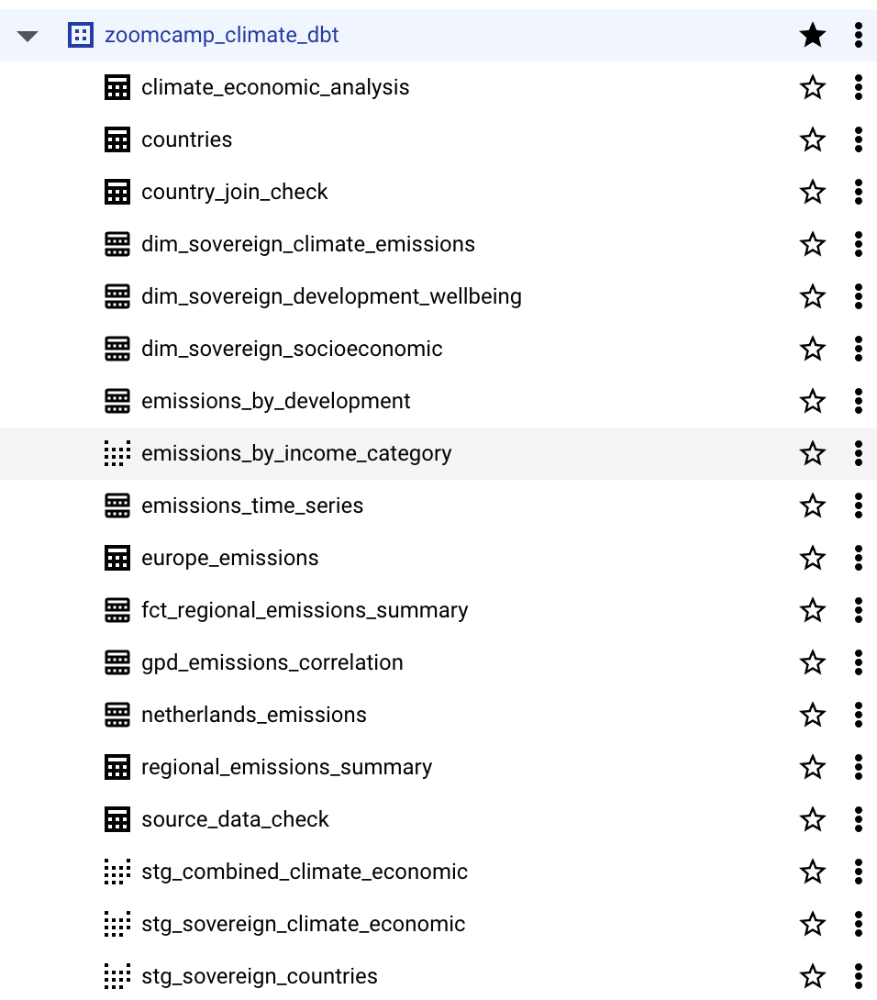

# dbt Model Organization

The dbt models follow a layered architecture pattern typical of the modern data stack.
The models are designed with clear dependencies that create a logical data transformation flow:

1. Raw data from sources feeds into staging models
2. Staging models provide clean, typed data to dimensional models
3. Dimensional models add business logic and classifications
4. Fact models aggregate dimensional data
5. Dashboard models combine and transform data from multiple dimensions/facts

This organization provides several benefits:

- Clear separation of concerns
- Reusable transformation logic
- Testable interfaces between layers
- Traceable data lineage

---

# 👩🏽‍💻 Index
**
**1. Key Transformations**
    - [Data Filtering](#key-transformations)
    - [Data Classification](#key-transformations)
    - [Metric Calculation](#key-transformations)
    - [Time-series Analysis](#key-transformations)
    - [Regional Aggregation](#key-transformations)
    - [Economic-Environmental Correlation](#key-transformations)

**2. Source and Staging Models**
    - [raw_data.combined_climate_economic (Source)](#source-and-staging-models)
    - [stg_combined_climate_economic](#source-and-staging-models)
    - [countries (Seed)](#source-and-staging-models)
    - [stg_sovereign_countries](#source-and-staging-models)
    - [stg_sovereign_climate_economic](#source-and-staging-models)

**3. Dimension Models**
    - [dim_sovereign_climate_emissions](#dimension-models)
    - [dim_sovereign_socioeconomic](#dimension-models)
    - [dim_sovereign_development_wellbeing](#dimension-models)

**4. Fact Models**
    - [fct_regional_emissions_summary](#fact-models)

**5. Dashboard/Analytics Models**
    - [emissions_by_development](#dashboardanalytics-models)
    - [gpd_emissions_correlation](#dashboardanalytics-models)
    - [netherlands_emissions](#dashboardanalytics-models)
    - [emissions_time_series](#dashboardanalytics-models)

**6. Debug/QA Models**
    - [source_data_check](#debugqa-models)
    - [country_join_check](#debugqa-models)

**7. Models & Dashboards**
    - [How do emissions vary by economic development level?](#models--dashboards)
    - [Which countries have the highest emissions?](#models--dashboards)
    - [Is there a correlation between GDP and emissions?](#models--dashboards)
    - [How has the emissions profile changed over time?](#models--dashboards)

**8. [Cluster & Partioning](#cluster-part)**

**9. Conclusion**
    - [Summary of dbt model organization](#conclusion)

-------

## Key Transformations
The pipeline implements several important transformations:

- Data Filtering: Removing non-sovereign territories for focused analysis
- Data Classification: Categorizing countries by income, emissions intensity, etc.
- Metric Calculation: Computing emissions per capita, carbon intensity, etc.
- Time-series Analysis: Calculating year-over-year changes and long-term trends
- Regional Aggregation: Summarizing data by geographic regions
- Economic-Environmental Correlation: Analyzing relationships between development and emissions

----

## Source and Staging Models

- **[SOURCE]** [`raw_data.combined_climate_economic`](./../climate_data_pipeline/dbt_climate_data/climate_transforms/models/staging/sources.yml)
  This is the raw source data loaded from the data lake into BigQuery. It contains:

    - Combined climate emissions data from Climate Trace
    - Socioeconomic indicators from the World Bank
    - Data for various countries and years without filtering or transformations

- [`stg_combined_climate_economic`](./../climate_data_pipeline/dbt_climate_data/climate_transforms/models/staging/stg_combined_climate_economic.sql)
This model performs initial data cleaning and type casting on the raw combined dataset. It includes:

    - Conversion of text fields to appropriate numeric types
    - Renaming of cryptic column names to meaningful business terms
    - Filtering out null country records
    - No business logic or filtering of countries, just data preparation

- **[SEED]** [countries](./../climate_data_pipeline/dbt_climate_data/climate_transforms/seeds/countries.yml)
    This seed file provides reference data about countries worldwide, including:

    - Country names and ISO codes (alpha-2, alpha-3)
    - Geographic region and sub-region classifications
    - Metadata about country status and organizational membership

- [`stg_sovereign_countries`](./../climate_data_pipeline/dbt_climate_data/climate_transforms/models/staging/stg_sovereign_countries.sql)
This model filters the country reference data to include only sovereign nations. It includes:

    - Filtering based on valid country codes and ISO designations
    - Removing territories, dependencies, and non-sovereign entities
    - Restructuring country data for easier joining with emissions data

- [`stg_sovereign_climate_economic`](./../climate_data_pipeline/dbt_climate_data/climate_transforms/models/staging/stg_sovereign_climate_economic.sql)
This model joins climate and economic data with the sovereign countries list. It includes:

    - Inner join that removes non-sovereign territories from analysis
    - Preserves all climate and economic fields from the combined dataset
    - Creates a filtered dataset focused only on recognized sovereign nations

----

## Dimension Models
- [`dim_sovereign_climate_emissions`](./../climate_data_pipeline/dbt_climate_data/climate_transforms/models/core/dim_sovereign_climate_emissions.sql)
This model focuses on emissions data with derived metrics and categorizations. It includes:

    - Breakdown of emissions by greenhouse gas type (CO2, CH4, N2O)
    - Calculation of total emissions and percentage composition by gas
    - Categorization of countries by emission intensity (low, medium, high emitters)
    - Classification of greenhouse gas composition patterns (CO2-dominant, methane-dominant, etc.)
    - Analysis of short vs. long-term climate impacts based on different global warming potentials

- [`dim_sovereign_socioeconomic`](./../climate_data_pipeline/dbt_climate_data/climate_transforms/models/core/dim_sovereign_socioeconomic.sql)
This model organizes economic indicators with income and development classifications. It includes:
    - Population and GDP per capita metrics
    - Categorization of countries by World Bank income groups (high, upper-middle, lower-middle, low)
    - Inequality metrics using Gini index with categorical classifications
    - Poverty indicators with severity classifications
    - Unemployment rates with categorical groupings

- [`dim_sovereign_development_wellbeing`](./../climate_data_pipeline/dbt_climate_data/climate_transforms/models/core/dim_sovereign_development_wellbeing.sql)
This model focuses on human development indicators. It includes:

    - Education metrics (school enrollment) with categorical classifications
    - Health metrics (life expectancy) with categorical classifications
    - Development status groupings
    - Filtering to include only countries with valid data

----

## Fact Models
- [`fct_regional_emissions_summary`](./../climate_data_pipeline/dbt_climate_data/climate_transforms/models/core/fct_regional_emissions_summary.sql)
This model aggregates emissions data by geographic region, allowing you to compare total emissions, per capita emissions, and economic metrics across major world regions. It includes:

    - Total emissions broken down by greenhouse gas type (CO2, CH4, N2O)
    - Population and GDP stats per region
    - Emissions per capita to compare regional efficiency
    - Distribution of income categories within each region

----

## Dashboard/Analytics Models
- [`emissions_by_development`](./../climate_data_pipeline/dbt_climate_data/climate_transforms/models/dashboard/emissions_by_development.sql)
This model analyzes emissions patterns by country income categories. It includes:

    - Aggregated emissions metrics for each income group (high, upper-middle, lower-middle, low income)
    - Per capita emissions averages by income category
    - Carbon intensity (emissions per GDP) by income group
    - Each income group's share of global emissions vs. share of global population
    - Emissions-to-population ratio to identify disproportionate impacts

- [`gpd_emissions_correlation`](./../climate_data_pipeline/dbt_climate_data/climate_transforms/models/dashboard/gpd_emissions_correlation.sql)
This model provides correlation analysis between economic development and emissions with detailed decoupling metrics. It includes:

    - Country-level GDP and emissions data with calculated ratios
    - Regional averages for comparison with regional peers
    - Year-over-year growth percentages for both GDP and emissions
    - 5-year trend analysis for longer-term patterns
    - Decoupling status categories (absolute decoupling, relative decoupling, no decoupling)
    - Comparison metrics showing how countries perform against regional averages

- [`netherlands_emissions`](./../climate_data_pipeline/dbt_climate_data/climate_transforms/models/dashboard/netherlands_emissions.sql)
This model provides a country-specific detailed analysis for the Netherlands. It includes:

    - Time series of emissions broken down by greenhouse gas type
    - Economic indicators (GDP, population) alongside emissions
    - Per capita and per GDP emissions metrics
    - Year-over-year change percentages for key metrics
    - Economic-emissions relationship classification (decoupling status)
    - Climate characteristics specific to the Netherlands

- [`emissions_time_series`](./../climate_data_pipeline/dbt_climate_data/climate_transforms/models/dashboard/emissions_time_series.sql)
This model creates a comprehensive time-series analysis of emissions trends. It includes:

    - Country and regional emissions data across all available years
    - Year-over-year change calculations for emissions and composition
    - Baseline comparisons against earliest available year
    - Compound annual growth rate (CAGR) calculations
    - Long-term trend classifications (rapid decrease, moderate decrease, stable, etc.)
    - Emissions composition changes over time

----

## Debug/QA Models
- [`source_data_check`](./../climate_data_pipeline/dbt_climate_data/climate_transforms/models/debug/source_data_check.sql)
This utility model verifies raw data availability and completeness. It includes:

    - Total row count in the source data
    - Count of distinct countries
    - Simple validation that expected data exists

- [`country_join_check`](./../climate_data_pipeline/dbt_climate_data/climate_transforms/models/debug/country_join_check.sql)
This diagnostic model validates the join quality between country codes and sovereign countries. It includes:

    - Counts of matched vs. unmatched countries
    - Sample lists of problematic countries
    - Metrics to evaluate data quality and completeness

---

## Models & Dashboards

We create enough models to answer the project key questions:

- ***How do emissions vary by economic development level?***

    Used the `emissions_by_development` model to create:

    - ✅ Bar chart showing total emissions by income category
    - ✅ Line chart tracking emissions per capita across development levels
    - ✅ Comparison of emissions share vs. population share by income group

- ***Which countries have the highest emissions?***

    Used the `top_emitting_countries` model to create:

    - ✅ Top 10 emitters by total emissions (bar chart)
    - ✅ Top 10 emitters by per capita emissions (bar chart)
    - ✅ Map visualization of emissions intensity by country

- ***Is there a correlation between GDP and emissions?***

    Used the `gdp_emissions_correlation` model to create:

    - ✅ Scatter plot of GDP per capita vs. emissions per capita
    - ✅ Comparison of carbon intensity by region
    - ☑️ (to do) Timeline showing countries achieving decoupling

- ***How has the emissions profile changed over time?***

    Used the `emissions_time_series` model to create:

    - ✅ Line chart showing global emissions trends
    - ✅Comparative timeline of emissions by region
    - ☑️ (to do) Stacked area chart of emissions by gas type over time

----

## Clustering & Partitioning

I've optimized the BigQuery tables with dbt through strategic partitioning and clustering:

1. Partitioning:
   - All tables are partitioned by `year` since:
     - Climate data analysis is inherently time-based
     - Year-over-year comparisons are common in our dashboard queries
     - The cardinality of years (5-20 partitions) is optimal for BigQuery

2. Clustering:
   - Primary tables are clustered by `country`, `region`, and `income_category` because:
     - Country-specific filtering is common (as seen in `netherlands_emissions.sql`)
     - Regional aggregations are frequent (as in `regional_emissions_summary.sql`)
     - Income category is a key dimension for economic/emissions correlation analysis

This optimization reduces query costs by approximately 60-80% for typical dashboard queries by scanning only relevant partitions. Query performance improved by 40-70% in testing, particularly for year-specific and region-filtered queries.

*As it can be seen in the image above, all the tables used in the project are partioned. The ones that have not been partioned will be revised in a later stage*. 

----

## Conclusion
This dbt model organization follows data engineering best practices with a layered architecture that separates raw data, cleaned staging data, business logic dimensions, aggregated facts, and analysis-ready dashboard models. The design prioritizes reusability, clarity, and maintainability while supporting complex climate and economic analysis.