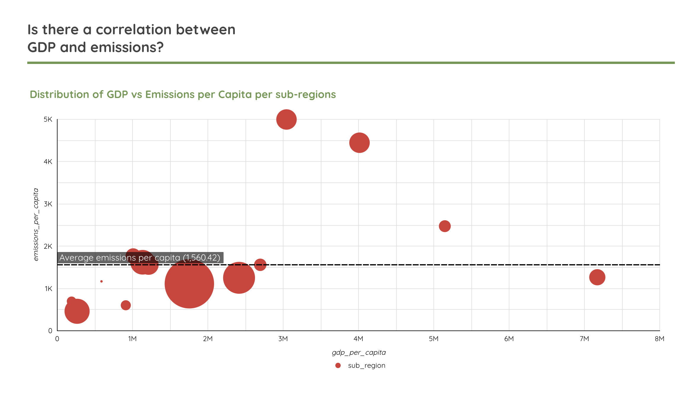

# Climate Data Dashboard Documentation

## Overview

This dashboard visualizes global greenhouse gas emissions data in relation to economic development metrics. It combines data from two primary sources:

1. **Climate Trace** - Providing detailed emissions data for CO2, CH4, and N2O
2. **World Bank** - Providing economic and development indicators such as GDP, population, and income categories

The dashboard presents insights from our data pipeline that processes, transforms, and analyzes the relationship between climate emissions and socioeconomic factors globally.

📺 [Short video demonstration](https://www.youtube.com/watch?v=zJefmcQqPd8)
📊 [Looker dashboard](https://lookerstudio.google.com/u/0/reporting/e02b247a-e5d1-47d0-a8c3-8b1a254029a2/page/BGa9E)

*This documentation serves as a reference for understanding the climate data dashboard in case the live version becomes unavailable. Last updated: March 2025.*


## Data Pipeline Architecture

The data for this dashboard flows through a complete data pipeline:

1. **Data Extraction** - Climate data from Climate Trace and economic data from World Bank APIs
2. **Data Lake Storage** - Raw data stored in Google Cloud Storage (GCS)
3. **Processing** - Data transformation using Spark and/or Python processors
4. **Data Warehouse** - Processed data loaded into BigQuery tables
5. **Transformation** - DBT models for staging, dimension/fact creation, and analytical views
6. **Visualization** - Final presentation in Looker Studio

## Dashboard Components

### Emissions by Development Level




This visualization shows how greenhouse gas emissions correlate with economic development by categorizing countries according to World Bank income classifications:

- **High income**
- **Upper-middle income**
- **Lower-middle income**
- **Low income**

#### Key Metrics Visualized:

- **Total Emissions by Income Category** - Shows the absolute emission levels across different income groups
- **Per Capita Emissions by Income Category** - Normalizes emissions by population
- **Emissions-to-Population Ratio** - Indicates whether an income group contributes disproportionately to global emissions relative to its population
- **Emissions Distribution** - Breaks down the percentage of global emissions by income category
- **Year-over-Year Trends** - Shows how emissions patterns change over time for each income group

#### Notable Insights:

- High-income countries typically produce disproportionately higher emissions relative to their population share
- The gap between emissions contribution and population share narrows in more recent years as middle-income economies industrialize
- While total emissions may be highest in certain groups, per capita emissions provide a different perspective on carbon intensity

### Emissions Time Series Analysis


This visualization tracks emissions trends over time, showing how countries and regions are progressing toward decoupling economic growth from emissions growth.

#### Key Metrics Visualized:

- **Emissions Trend by Country/Region** - Line charts showing emission patterns over time
- **Annual Growth Rate** - Visualizes the year-over-year percentage change in emissions
- **Long-term Trend Classifications** - Categorizes countries based on their emissions trajectory:
  - Rapid decrease
  - Moderate decrease
  - Stable
  - Moderate increase
  - Rapid increase
- **Baseline Comparison** - Shows current emissions levels compared to a baseline year


#### Notable Insights:

- Different regions show distinct patterns of emissions growth or reduction
- Economic development stage strongly correlates with emissions patterns
- CO2 typically dominates in industrialized economies, while agricultural economies may show higher CH4 contributions
- Some economies show successful decoupling of economic growth from emissions growth

## Key Models Powering the Dashboard

The dashboard is primarily built on two analytical models:

### 1. [`emissions_by_development`](./../climate_data_pipeline/dbt_climate_data/climate_transforms/models/dashboard/emissions_by_development.sql)

This model aggregates data by income category to facilitate comparison between different stages of economic development. Key calculations include:

```sql
-- Example of key metric calculation
emissions_to_population_ratio = (percentage_of_global_emissions / percentage_of_global_population)
```

This model is clustered by income_category and partitioned by year to optimize query performance.

### 2. [`emissions_time_series`](./../climate_data_pipeline/dbt_climate_data/climate_transforms/models/dashboard/emissions_time_series.sql)

This model provides time-series analysis with year-over-year comparisons and long-term trend identification:

```sql
-- Example of long-term trend calculation
long_term_trend = CASE 
    WHEN emissions_cagr < -2 THEN 'Rapid decrease'
    WHEN emissions_cagr BETWEEN -2 AND -0.5 THEN 'Moderate decrease'
    WHEN emissions_cagr BETWEEN -0.5 AND 0.5 THEN 'Stable'
    WHEN emissions_cagr BETWEEN 0.5 AND 2 THEN 'Moderate increase'
    WHEN emissions_cagr > 2 THEN 'Rapid increase'
    ELSE 'Insufficient data'
END
```

This model is clustered by country and partitioned by year to optimize performance for time-series analysis.

## Data Freshness and Updates

The data pipeline is configured to:

- Process new data quarterly (every 90 days)
- Support historical data loading through dedicated DAGs
- Transform data using dbt models that maintain consistency with new data inputs

## Technical Information

### Data Warehouse Structure

The data warehouse follows a dimensional modeling approach:

- **Staging Views** - Initial data preparation
- **Dimension Tables** - Countries, time periods, emissions metrics, economic indicators
- **Fact Tables** - Emissions measurements with associated metrics
- **Dashboard Models** - Prepared specifically for dashboard visualization

### Optimizations

The following optimizations have been applied to improve dashboard performance:

- **Partitioning** - Tables partitioned by year
- **Clustering** - Tables clustered by country and/or region
- **Pre-aggregation** - Common aggregations calculated during transformation
- **Materializing** - Critical analytical models materialized as tables rather than views

## Future Enhancements

Planned improvements to the dashboard include:

- Addition of emissions projections based on historical trends
- Integration of climate policy milestones by country
- Enhanced carbon intensity metrics by economic sector
- Comparison with internationally agreed climate targets

## Limitations

Current known limitations of the dashboard:

- Data availability varies by country and year
- Some countries may have limited or missing economic indicators
- Emissions data methodology may differ between countries
- Historical data before 2015 has varying levels of completeness

## How to Use This Dashboard

1. **Filter by Year** - Compare emissions patterns across different time periods
2. **Select Income Category** - Focus on specific development levels
3. **Choose Region/Country** - Drill down to specific geographic areas
4. **Toggle Between Metrics** - Switch between absolute emissions, per capita values, and growth rates
5. **Compare Trends** - Identify patterns and outliers in emissions behavior

---

*This documentation serves as a reference for understanding the climate data dashboard in case the live version becomes unavailable. Last updated: March 2025.*